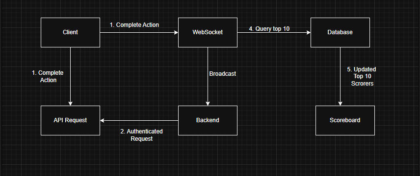

# Architecture

Problem Link: https://s5tech.notion.site/Problem-6-Architecture-3c32e217fa1d4a6b9b6742faec43097f

# Live Scoreboard Update API Module

## Overview

This module provides an authenticated API endpoint that updates user scores and broadcasts the top 10 scoreboard to all connected clients in real time using WebSocket.

---

## Features

- Secure score updates via authenticated API
- Real-time leaderboard updates via WebSocket
- Scalable database design
- Rate-limiting and abuse prevention

---

## Architecture Flow

1. A user completes an in-game action.
2. The frontend sends an authenticated API request to update the score.
3. The backend verifies the request and updates the database.
4. If the updated score affects the top 10 leaderboard:
   - The backend queries the latest top 10 users.
   - Broadcasts the new top 10 via WebSocket to all clients.

---

## API Specification

[Detailed in here](./API.md)

---

## Database Schema

Link: https://dbdiagram.io/d/68901a07cca18e685c0d033f

---

## Security

- All updates require a valid JWT token.
- Validate input to prevent score tampering.
- Apply rate limiting to prevent abuse.
- Optionally log all score changes for auditing.

---

## Suggestions for Future Improvements

- Cache top 10 scores with Redis for faster performance.
- Add audit log for admin to track suspicious activity.
- Extend API to support score reset or manual overrides.
- Support multiple leaderboards (e.g. by region, game mode).
